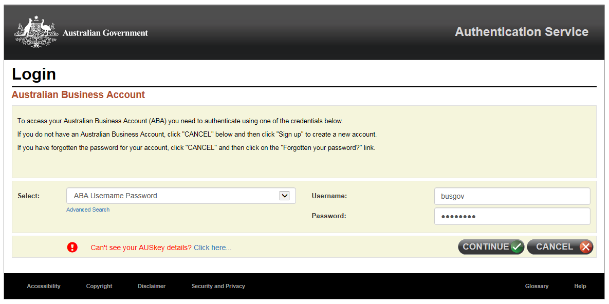

	

	<h1 id="heading" tabindex="-1">{{ page.title }}</h1>
	
<strong>Welcome to the Australian Government Business Registration Service.</strong>

	
Here you can apply for an AUSkey for yourself or others associated with your business.<a class="cd-btn help" href="#">more information</a>

	

		<h2>Access required</h2>
		

			<h3>Applying for an AUSkey</h3>
			
You can either apply for a new AUSkey for yourself, if your business has not been issued with an AUSkey before, or you can use your AUSkey credentials to apply for additional AUSkeys on behalf of other business associates.

			
Make your selection then click &apos;Continue&apos; and you will be redirected to the appropriate login screen to validate your identity if required.

			

				

					<label class="input-right" for="auskey-type">Are you applying for a new AUSkey for yourself or on behalf of other business associate(s)?</label>
				

				

					

						<label class="on label-left" for="yourself">
							<input id="yourself" name="auskey-type" onclick="$('#individual').show(); $('#additional-auskeys').hide();" type="radio" value="Yes">
							Yourself
						</label>
						<label class="off label-right" for="other-assoc">
							<input id="other-assoc" name="auskey-type" onclick="$('#individual').hide(); $('#additional-auskeys').show()" type="radio" value="No">
							Other associates
						</label>
					
 
					
				

			

			

				

					<button class="btn cancel" type="submit" onclick="location.href='index'">Previous</button>
					<button class="btn btn-default" id="next-btn" type="button" disabled>Continue</button>
				

			

		

	

	

		<h2 id="auskey-heading">AUSkey details</h2>
		

			

				<h3>Business details</h3>
				

					

						<label class="input-right" for="abn">Australian Business Number (ABN)</label>
					

					

						<input id="abn" type="text" value=""> <button id="select-abn" type="button">...</button> 
						

							
<strong>The Business Pty Ltd mike.ross@business.com</strong>

						

					

				

				<fieldset id="Associates_PersonAssociate_Roles">
					<legend class="larger">Your details</legend>
					

						

							<label class="input-right" for="associate-type">Associate type</label>
						

						

							<select id="associate-type">
								<option value="">--- please select ---</option>
								<option>Trustee</option>
								<option>Public officer</option>
								<option>Director</option>
								<option>Partner</option>
								<option>Office bearer of a club / association</option>
							</select>
						

					

					

						

							<label class="input-right" for="Associates_PersonAssociate_GivenName">Given name</label>
						

						

							<input id="Associates_PersonAssociate_GivenName" name="Associates.PersonAssociate.GivenName" type="text" value=""> 
							
						

					

					

						

							<label class="input-right" for="Associates_PersonAssociate_OtherName">Other given name (optional)</label>
						

						

							<input id="Associates_PersonAssociate_OtherName" name="Associates.PersonAssociate.OtherName" type="text" value=""> 
							
						

					

					

						

							<label class="input-right" for="Associates_PersonAssociate_FamilyName">Family name</label>
						

						

							<input id="Associates_PersonAssociate_FamilyName" name="Associates.PersonAssociate.FamilyName" type="text" value=""> 
							
						

					

					

						

							<label class="input-right" for="Associates_PersonAssociate_TaxFileNumber">Tax File Number (optional)</label>
						

						

							<input id="Associates_PersonAssociate_TaxFileNumber" name="Associates.PersonAssociate.TaxFileNumber" type="number" value=""> <a class="cd-btn help" href="#help-businessdetailspersondetailstaxfilenumber">Help - Tax File Number (TFN)</a>
							
						

					

					

						

							<label class="input-right" for="Associates_PersonAssociate_DateOfBirth">Date of birth</label>
						

						

							<input class="date hasDatepicker" data-val="true" data-val-date="The field DateOfBirth must be a date." id="Associates_PersonAssociate_DateOfBirth" name="Associates.PersonAssociate.DateOfBirth" type="text" value=""><button type="button" class="ui-datepicker-trigger"></button>                    
						

					

					

						

							<label class="input-right" for="ContactDetails_Email">Email</label>
						

						

							<input id="ContactDetails_Email" name="ContactDetails.Email" type="email" value="email@email.com"> <a class="cd-btn help" href="#help-companydetailscontactdetailsemail">Help - Email address</a>
							
						

					

					

						

							<label class="input-right" for="AuthorisedContacts_AuthorisedContact_BusinessHoursPhone">Phone number</label>
						

						

							<input id="AuthorisedContacts_AuthorisedContact_BusinessHoursPhone" name="AuthorisedContacts.AuthorisedContact.BusinessHoursPhone" type="text" value=""> 
							
						

					

					
				</fieldset>
				

					<h3 class="larger">Declaration</h3>
					
Please complete the declaration below to submit your application.

					

						

							

								<fieldset id="auskey-declaration" class="custom-controls">
									<legend class="larger no-padding">AUSkey</legend>
									

										<input id="AUSKeyCheckBox" name="AUSKeyCheckBox" type="checkbox" value="true">
										<label id="ato-auskey-check" for="AUSKeyCheckBox">I am eligible for an AUSKey and I declare that: 
										I am authorised to make this application on behalf of the Business. 
										This application is for an AUSKey to be held for that business. 
										I understand the terms and conditions associated with that AUSkey. 
										Notices about this AUSkey application and that AUSkey may be sent to the email address recorded for the business on the ABR. </label>
									

								</fieldset>
							

							

								<h3>Privacy</h3>
								
The information provided to the ABR and the ATO in this form may include personal information. Please refer to the <a href="https://abr.gov.au/General-information/Privacy/Privacy---abr-gov-au-website" target="_blank">ABR privacy policy (opens in new window)</a> for more information about how we handle your personal information, your rights to seek access to and correct personal information, and to complain about breaches of privacy.

							

						

					

				

			

			

				<h3>Business details</h3>
				<table id="business-details">
					<thead class="visuallyhidden">
						<tr>
							<th>Field item</th>
							<th>Input value</th>
						</tr>
					</thead>
					<tbody>
						<tr>
							<td width="25%" class="field-name bold">ABN</td>
							<td width="75%" class="input-value">44 123 456 789</td>
						</tr>
						<tr>
							<td class="field-name bold">Entity name</td>
							<td class="input-value">Really Awesome Business Pty Ltd</td>
						</tr>
						<tr>
							<td class="field-name bold top">Contact email</td>
							<td class="input-value">
								
mike.ross@business.com

								<!-- <ul class="reg-list retrieve">
									<li> Goods and Services Tax (GST)</li>
									<li> Pay As You Go (PAYG) withholding</li>
								</ul> -->
							</td>
						</tr>
					</tbody>
				</table>
				<h3>Authorisations</h3>
				

					
None added

					

						<table class="margin-bottom-075">
							<thead class="visuallyhidden">
								<tr>
									<th>Field item</th>
									<th>Input value</th>
								</tr>
							</thead>
							<tbody id="ass1" style="display: none;">
								<tr>
									<th style="vertical-align: middle"> Fred Albert Nerk</th>
									<th>
										<button type="button" id="delete-ass1" class="btn btn-default ico-remove">Remove</button>
										<button type="button" id="edit-auth" class="btn btn-default ico-edit">Edit</button>
									</th>
								</tr>
								<tr>
									<td class="field-name">Associate type</td>
									<td class="input-value">Director</td>
								</tr>
								<tr>
									<td class="field-name">Tax File Number (TFN)</td>
									<td class="input-value">123456789</td>
								</tr>
								<tr>
									<td class="field-name">Date of birth</td>
									<td class="input-value">16/05/1996</td>
								</tr>
								<tr>
									<td class="field-name">Email</td>
									<td class="input-value">fred@email.com</td>
								</tr>
								<tr>
									<td class="field-name">Phone number</td>
									<td class="input-value">55555555</td>
								</tr>
							</tbody>
							<tbody id="ass2" style="display: none;">
								<tr>
									<th style="vertical-align: middle"> Simon Arthur Bourke</th>
									<th>
										<button type="button" id="delete-ass2" class="btn btn-default ico-remove">Remove</button>
										<button type="button" id="edit-auth" class="btn btn-default ico-edit">Edit</button>
									</th>
								</tr>
								<tr>
									<td class="field-name">Associate type</td>
									<td class="input-value">Public officer</td>
								</tr>
								<tr>
									<td class="field-name">Tax File Number (TFN)</td>
									<td class="input-value">987654321</td>
								</tr>
								<tr>
									<td class="field-name">Date of birth</td>
									<td class="input-value">27/09/1976</td>
								</tr>
								<tr>
									<td class="field-name">Email</td>
									<td class="input-value">simon@email.com</td>
								</tr>
								<tr>
									<td class="field-name">Phone number</td>
									<td class="input-value">66666666</td>
								</tr>
							</tbody>
						</table>
					

					

						<button id="btn-add-auth" class="btn btn-inline margin-bottom-075" type="button">Add authorisation</button>
					

				

				

					<h3 class="larger">Declaration</h3>
					
Please complete the declaration below to submit your application.

					

						

							

								<fieldset id="auskey-declaration" class="custom-controls">
									<legend class="larger no-padding">AUSkey</legend>
									

										<input id="AUSKeyCheckBox" name="AUSKeyCheckBox" type="checkbox" value="true">
										<label id="ato-auskey-check" for="AUSKeyCheckBox">The person(s) identified as associate(s) are eligible for an AUSKey and I declare that: 
										I am authorised to make this application on behalf of the Business. 
										This application is for an AUSKey to be held for that business. 
										I understand the terms and conditions associated with that AUSkey. 
										Notices about this AUSkey application and that AUSkey may be sent to the email address recorded for the business on the ABR. </label>
									

								</fieldset>
							

							

								<h3>Privacy</h3>
								
The information provided to the ABR and the ATO in this form may include personal information. Please refer to the <a href="https://abr.gov.au/General-information/Privacy/Privacy---abr-gov-au-website" target="_blank">ABR privacy policy (opens in new window)</a> for more information about how we handle your personal information, your rights to seek access to and correct personal information, and to complain about breaches of privacy.

							

						

					

				

			

			

				

					<button class="btn cancel previous" type="submit">Previous</button>
					<button class="btn btn-default" id="next-cd-btn" type="button">Confirm and submit</button>
				

			

		

	

	

		<fieldset id="Associates_PersonAssociate_Roles">
			<legend class="has-help larger">Associate details</legend>
			

				

					<label class="input-right" for="associate-type">Associate type</label>
				

				

					<select id="associate-type">
						<option value="">--- please select ---</option>
						<option>Trustee</option>
						<option>Public officer</option>
						<option>Director</option>
						<option>Partner</option>
						<option>Office bearer of a club / association</option>
					</select>
				

			

			

				

					<label class="input-right" for="Associates_PersonAssociate_GivenName">Given name</label>
				

				

					<input id="Associates_PersonAssociate_GivenName" name="Associates.PersonAssociate.GivenName" type="text" value=""> 
					
				

			

			

				

					<label class="input-right" for="Associates_PersonAssociate_OtherName">Other given name (optional)</label>
				

				

					<input id="Associates_PersonAssociate_OtherName" name="Associates.PersonAssociate.OtherName" type="text" value=""> 
					
				

			

			

				

					<label class="input-right" for="Associates_PersonAssociate_FamilyName">Family name</label>
				

				

					<input id="Associates_PersonAssociate_FamilyName" name="Associates.PersonAssociate.FamilyName" type="text" value=""> 
					
				

			

			

				

					<label class="input-right" for="Associates_PersonAssociate_TaxFileNumber">Tax File Number (optional)</label>
				

				

					<input id="Associates_PersonAssociate_TaxFileNumber" name="Associates.PersonAssociate.TaxFileNumber" type="number" value=""> <a class="cd-btn help" href="#help-businessdetailspersondetailstaxfilenumber">Help - Tax File Number (TFN)</a>
					
				

			

			

				

					<label class="input-right" for="Associates_PersonAssociate_DateOfBirth">Date of birth</label>
				

				

					<input class="date hasDatepicker" data-val="true" data-val-date="The field DateOfBirth must be a date." id="Associates_PersonAssociate_DateOfBirth" name="Associates.PersonAssociate.DateOfBirth" type="text" value=""><button type="button" class="ui-datepicker-trigger"></button>                    
				

			

			

				

					<label class="input-right" for="ContactDetails_Email">Email</label>
				

				

					<input id="ContactDetails_Email" name="ContactDetails.Email" type="email" value="email@email.com"> <a class="cd-btn help" href="#help-companydetailscontactdetailsemail">Help - Email address</a>
					
				

			

			

				

					<label class="input-right" for="AuthorisedContacts_AuthorisedContact_BusinessHoursPhone">Phone number</label>
				

				

					<input id="AuthorisedContacts_AuthorisedContact_BusinessHoursPhone" name="AuthorisedContacts.AuthorisedContact.BusinessHoursPhone" type="text" value=""> 
					
				

			

			
		</fieldset>
		

			

				<button class="btn btn-default ajax-button" id="add-person" type="button">Add</button>
				<button class="btn cancel ajax-button" type="button" id="cancel-assoc">Cancel</button>
			

		

	

	
Select an ABN:

	<table>
		<thead>
			<tr>
				<th>&nbsp;</th>
				<th>ABN</th>
				<th>Entity name</th>
			</tr>
		</thead>
		<tbody>
			<tr class="selectable">
				<td width="12%"></td>
				<td>123456789</td>
				<td>Qwertable Resources Pty Ltd</td>
			</tr>
			<tr class="selectable">
				<td></td>
				<td>555444333</td>
				<td>Hungry Hippos Pty Ltd</td>
			</tr>
			<tr class="selectable">
				<td></td>
				<td>987654321</td>
				<td>Achellisus Pty Ltd</td>
			</tr>
		</tbody>
	</table>
	<button type="button" class="btn btn-small" onclick="$('#abn-popup').dialog('close')">Cancel</button>
	<button id="abn-selected" type="button" class="btn btn-small btn-default">Select</button>

	<h1>Confirm remove</h1> 
	
Are you sure you want remove the associate?
 
	<input id="remove-ass1" type="button" class="btn btn-default" value="Yes, remove"/> 
	<a href="#" class="margin-left-075" onclick='visionaustralia.closeDialog("dialogThree");'>Cancel</a>

	<h1>Confirm remove</h1> 
	
Are you sure you want remove the associate?
 
	<input id="remove-ass2" type="button" class="btn btn-default" value="Yes, remove"/> 
	<a href="#" class="margin-left-075" onclick='visionaustralia.closeDialog("dialogFour");'>Cancel</a>

 

<link rel="stylesheet" href="{{ site.baseurl }}/css/jquery-ui.min.css">

